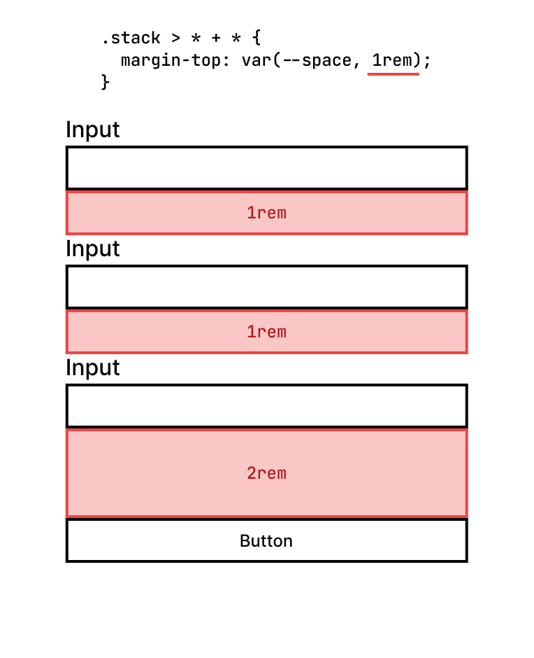

Being responsible for a Design System my job is to make sure it's as easy as possible for developers to build new UIs quickly while also making sure the UI looks consistent throughout the whole application. With default margins I fail to achieve both of those responsibilities.

Default margins on components are well intended, but from experience they cause more problems than they solve. Here's a quick example:

Let's say you have a row with multiple input fields. Now you could add some margin to every single input field, but that would mean adding a dozen or so classes just to add some spacing for every single input field, instead we add some bottom margin to _every_ input field, done. Default margins space out input fields in a consistent way across the whole app, which improves user experience.


Now we already have our first problem. At the bottom of the card, we have some unnecessary spacing. To get rid of that we can simply add a class to that element and remove the margin, or we could use a `:last-of-type` selector to it and remove the margin.

Default margins make base components work only in a single context. It's no longer a `TextInput` component but a `TextInputInACard` component.

But now, we need to use the `TextInput` inside a toolbar. Now we have the same problem again. The toolbar is too large. The solution? We add a class and remove the bottom margin. We have to do this every time we need to use the `TextInput` outside of a card. This goes against the idea of base components. We create base components so we can use them in any context, and not a specific one.


I recently talked to a developer who used the base components every day. For him, the biggest pain point was the default margin. He told me that he uses the base components outside of the card's body a lot. Sometimes in a top toolbar, in a card footer, or in a custom-built list. It annoyed him that he needed to manually remove the margin many times over and over.

## The solution

The solution? A) Remove _all_ default margins from your components. B) Let the parent element take care of the spacing. Either by simply using plain CSS with flexbox or grid, or the [lobotomized owl selector](https://alistapart.com/article/axiomatic-css-and-lobotomized-owls/). Or by using [Spacer components](https://mxstbr.com/thoughts/margin#use-spacers-instead). To keep this post short I only focus on the lobotomized owl.

```css
.stack > * + * {
  margin-top: var(--space, 1rem);
}
```

The above selector adds a top margin to every direct child except the first one. Just add the `.stack` class to the parent element and you're done.

```html
<form class="stack">
  <input label="Firstname" />

  <input label="Lastname" />

  <input label="Email" type="email" />

  <input label="Password" type="password" />
</form>
```


Now, what if you want to have spacing that's wider than 1rem? That's easy; just define a CSS custom property called `--space` using inline styles or by adding a custom class and defining the spacing there.

```html
<form class="stack" style="--space: 2rem;">
  <input label="Firstname" />

  <input label="Lastname" />

  <input label="Email" type="email" />

  <input label="Password" type="password" />
</form>
```

But what if I have an edge case where everything needs the same spacing except for one element? I've got you covered!

```html
<form class="stack">
  <input label="Firstname" />

  <input label="Lastname" />

  <input label="Email" type="email" />

  <input label="Password" type="password" />

  <button style="--space: 2rem;">Sign up</button>
</form>
```



## Potential downsides

I could not find many, even any arguments against using this approach. The only thing I could think of was that you would need to write more HTML. From personal experience I can say that having a little more markup is much easier than fiddling around with margin every time the component is used outside of its intended context.

But, if you found counterarguments feel free to message me. You can contact me via Twitter / X or LinkedIn.

## How to migrate

I hope you now get my point and agree that default margins are a pain. But how do we remove them? The first instinct might be to remove the default margin from the base components, manually go over all important areas in your app, and merge it. From experience, this is not a good approach. Those [big refactorings never work](https://vercel.com/blog/incremental-migrations). Here's why:

First, if you're working on a big application go up to your manager and ask them this: "Hey, I'd like to do some refactoring, this means I won't be able to build new features for a couple of days maybe even one or two weeks. Can we do that?" Good luck with that.

Second, did you ever create a PR where you touched hundreds of files and then needed to rebase? If yes, I feel you, you're not alone. If not, trust me it's not fun resolving a dozen or even more rebase conflicts.

So instead of migrating everything at once, we do it in small steps.

To do that you can use something I call Future Flags (for CSS).

```css
.input {
  /* Input styles... */

  margin-bottom: 1rem;
}

.future--remove-default-margin .input {
  margin-bottom: 0;
}
```

```html
<!-- Using the new approach -->
<Card title="Product" class="future--remove-default-margin stack">
  <input label="Product name" />

  <input label="Product number" />

  <input label="Price" />
</Card>

<!-- Still using default margins -->
<Card title="Manufacturer">
  <input label="Manufacturer name" />

  <input label="Link to manufacturer's website" />
</Card>
```

With that, we update only the first card to the new approach, but keep using the old approach for the other card. We then create a PR and merge it. That's all we do. The rest of the day we continue creating features or write bug fixes. Tomorrow, we do the same thing again. We add move the second card over to the new approach, merge it and continue with out usual work.

Once we're done with the migration, we can remove all `future--remove-default-margin` classes in our code and its declaration in the CSS file.

## Conclusion

- Default margins are well intended but only work in a single context
- Base components must work in all contexts
- Remove all default margins
- Let the parent take care of spacing by using flexbox and grid or Spacer components
- Prefer an incremental migration over a big-bang migration